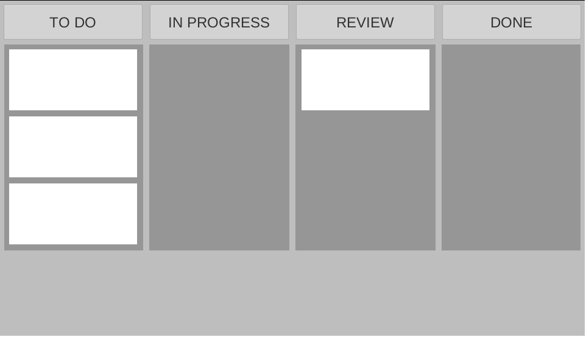
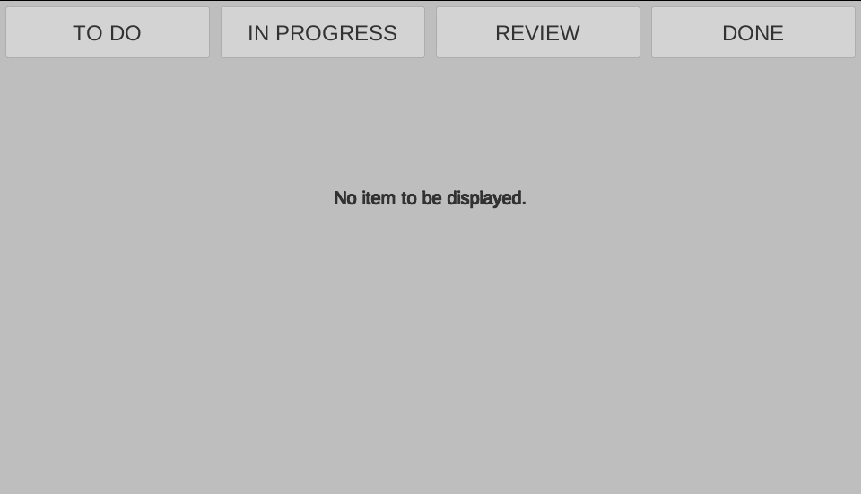
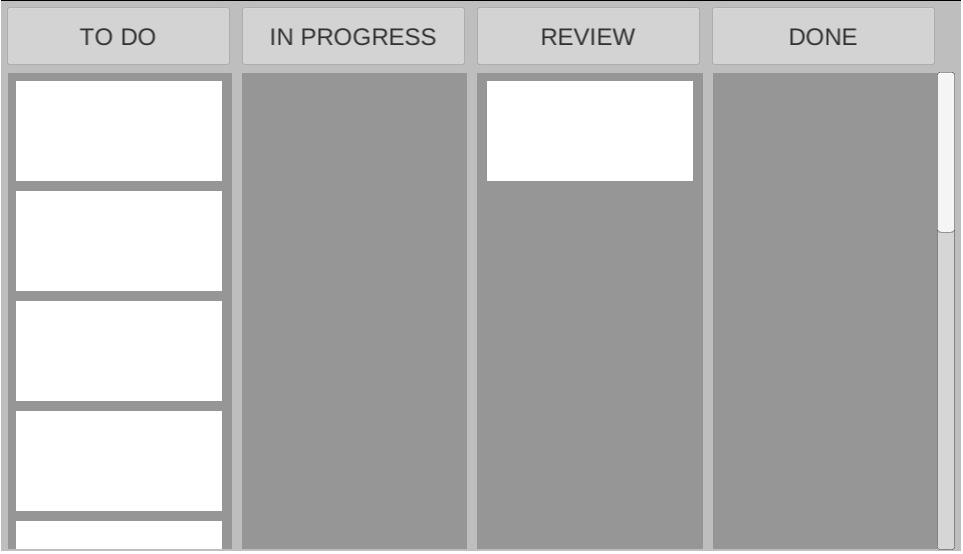
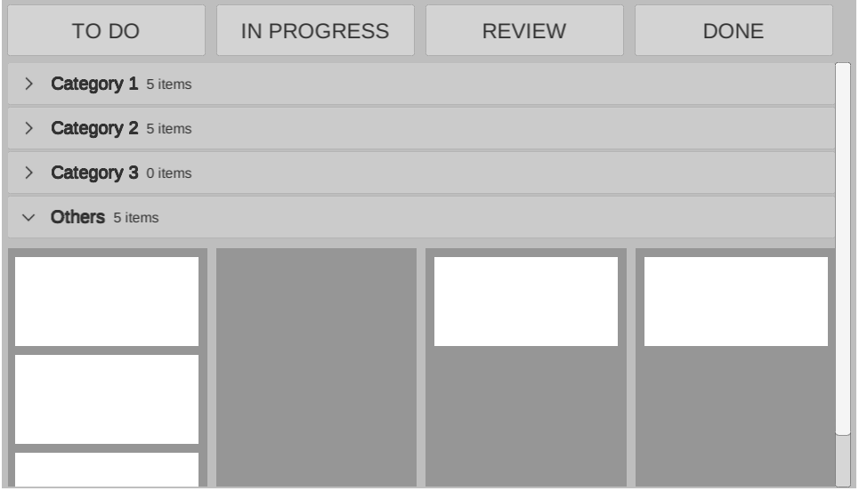
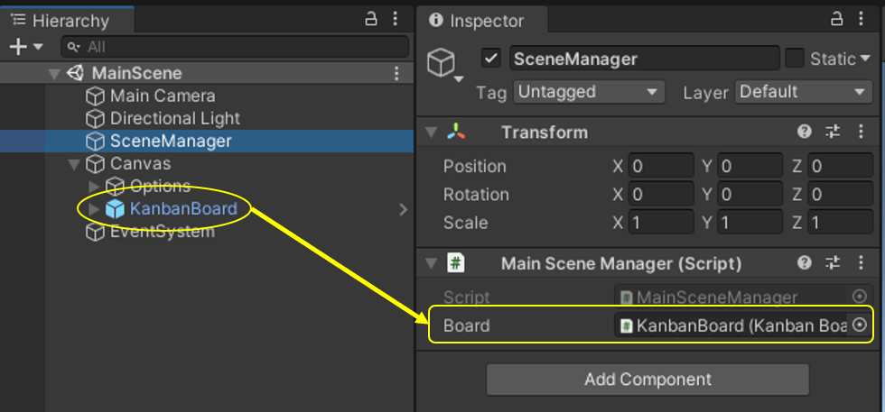

# Unity-Kanban-Board

This project provides the implementation of a kanban board for displaying items as cards under their associated pipeline. Kanban boards are commonly used to display and monitor progress. [- wikipedia](https://en.wikipedia.org/wiki/Kanban_board). 

This kanban board provides the following features:


| Setting pipline stages and adding items | Handling empty lists | 
| :-----: | :-------: |
|  |  |
| Scrollable with bigger datasets | Grouping |
|  |  |

# Demo


We created a WebGL application that demonstrates different features provided by our kanban view.
A complete demo can be found on [https://omaddam.github.io/Unity-Kanban-Board/](https://omaddam.github.io/Unity-Kanban-Board/).

# Getting Started

These instructions will get you a copy of the project on your local machine for development and testing purposes.

### Prerequisites

The things you need to install before you proceed with development:

1) [Unity3d (2020.2.0f1)](https://unity3d.com/get-unity/download/archive) [required].

### Installing

A step by step guide to get you started with development.

#### Download, clone, and setup the repository

```git
git clone https://github.com/omaddam/Unity-Kanban-Board.git
```

#### Initialize git flow

```git
git flow init
```

# How to use this board in your project?

### 1. Add prefab
Create a canvas in your scene and add KanbadBoard.prefab underneath it then reference its manager in your script. `The prefab can be found under Assets/KanbanBoard/Prefabs.`



### 2. Prepare data
Create a `KanbanBoard.DataStructure.Board` instance and populate it with the pipeline stages, categories, and items.

Every pipleine has the following fields:
* Unique identifier
* Display name
  
Every category has the following fields:
* Unique identifier
* Display name

Every Item has the following fields:
* Unique identifier
* The pipeline stage it is currently at
* The category it belongs to (optional)

```C#
using UnityEngine;
using System;

// Create a new board
KanbanBoard.DataStructure.Board board = new KanbanBoard.DataStructure.Board();

// Populate with pipelines
KanbanBoard.DataStructure.Pipeline toDoPipeline = new KanbanBoard.DataStructure.Pipeline("TO DO");
KanbanBoard.DataStructure.Pipeline inProgressPipeline = new KanbanBoard.DataStructure.Pipeline("IN PROGRESS");
KanbanBoard.DataStructure.Pipeline reviewPipeline = new KanbanBoard.DataStructure.Pipeline("REVIEW");
KanbanBoard.DataStructure.Pipeline donePipeline = new KanbanBoard.DataStructure.Pipeline("DONE");
board.Pipelines.AddRange(new List<KanbanBoard.DataStructure.Pipeline>()
{
    toDoPipeline, inProgressPipeline, reviewPipeline, donePipeline
});

// Populate with categories
KanbanBoard.DataStructure.Category category1 = new KanbanBoard.DataStructure.Category("Category 1");
KanbanBoard.DataStructure.Category category2 = new KanbanBoard.DataStructure.Category("Category 2");
KanbanBoard.DataStructure.Category category3 = new KanbanBoard.DataStructure.Category("Category 3");
board.Categories.AddRange(new List<KanbanBoard.DataStructure.Category>()
{
    category1, category2, category3
});

// Populate with items
board.Items.Add(new KanbanBoard.DataStructure.Item(Guid.NewGuid(), toDoPipeline, category1));
board.Items.Add(new KanbanBoard.DataStructure.Item(Guid.NewGuid(), reviewPipeline, category1));
board.Items.Add(new KanbanBoard.DataStructure.Item(Guid.NewGuid(), toDoPipeline, null));
board.Items.Add(new KanbanBoard.DataStructure.Item(Guid.NewGuid(), toDoPipeline, category2));
board.Items.Add(new KanbanBoard.DataStructure.Item(Guid.NewGuid(), donePipeline, null));

```
### 3. Visualize network
Use the referenced kanban board manager to visualize the data.

```C#
/// <summary>
/// References the kanban board in the scene.
/// </summary>
public KanbanBoard.KanbanBoard Board;
```

```C#
// Display board
Board.Initialize(board);
```

If you want to group the items by their categories, use the following code instead.

```C#
// Display board
Board.Initialize
(
    board: board,
    groupByCategories: true
);
```

# Standards

### General Standards

* Line ending: CRLF
* Case styles: Camel, Pascal, and Snake case
  * Arguments, paramters, and local variables: camel case (e.g. kanbanBoard)
  * Global variables: pascal case (e.g. SeedItems)
  * Constants and static variables: snake case (ALL CAPS) (e.g. DEFAULT_CATEGORY_NAME)
* Methods naming convention:
  * Pascal case (e.g. GenerateSample)
  * Verbs

### Commenting Standards

* `///` Summaries: Full-usage of English grammar and punctuation. (e.g. Add periods to the end of your summaries, as if you were writing a phrase or sentence.)
*  `//` In-line comments: quick, point-form. Grammar and punctuation not needed

### Assets / App

* Contains all scripts and resources used in the demo.
* Scripts are created under Assets/App/Scripts folder.

### Assets / Others

* All components should be included under Assets/\<Name> folder. (e.g. Assets/KanbanBoard)
* Each component should be isolated and under **NO CIRCUMSTANCES** referencing or using another component's scripts.
* Components are **NOT** allowed to reference or call application/demo scripts.